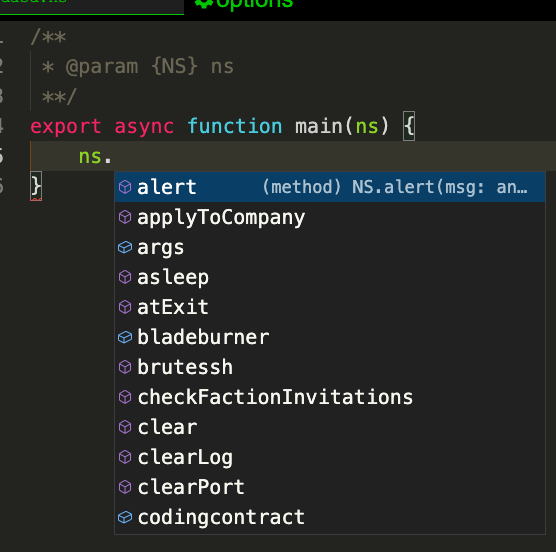

.. _netscriptjs:

NS2
===
The improved version of Netscript that
allows users to write full-fledged Javascript code in their scripts, while
still being able to access the Netscript functions.

ns2 was developed primarily by `Github user jaguilar <https://github.com/jaguilar>`_

On top of having almost all of the features and capabilities of JavaScript, ns2 is also
significantly faster than ns1.

This documentation will not go over any of the additional features of ns2, since
there is plenty of documentation on Javascript available on the web.

Browser compatibility
---------------------
As of the time of writing this, a few browsers do not support `dynamic import <https://developer.mozilla.org/en-US/docs/Web/JavaScript/Reference/Statements/import>`_ functionality and therefore cannot run ns2 scripts. These browsers will thus only be capable of using ns1.

How to use ns2
----------------------
Working with ns2 scripts is the same as ns1 scripts. The only difference
is that ns2 scripts use the ".ns" or ".js" extension rather than ".script". E.g.::

    $ nano foo.ns
    $ run foo.ns -t 100 arg1 arg2 arg3
    exec("foo.ns", "purchasedServer1", "100", "randomArg");

The caveat when using ns2 to write scripts is that your code must be
asynchronous. Furthermore, instead of using the global scope and executing your code
sequentially, ns2 uses a :code:`main()` function as an entry point.

Furthermore, the "Netscript environment" must be passed into a ns2 script through
the main function. This environment includes all of the pre-defined Netscript functions
(:code:`hack()`, :code:`exec`, etc.) as well as the arguments you pass to the script.

Therefore, the signature of the :code:`main()` function must be::

    export async function main(ns) {
        ns.print("Starting script here");
        await ns.hack("foodnstuff"); //Use Netscript hack function
        ns.print(ns.args);           //The script arguments must be prefaced with ns as well
    }

Here is a summary of all rules you need to follow when writing Netscript JS code:

* Write :code:`await` before any call to the following Netscript functions:

    * hack
    * grow
    * weaken
    * sleep
    * prompt
    * wget
    * scp
    * write
    * writePort

* Any function that contains :code:`await` must be declared as :code:`async`

* Always :code:`await` any function that is marked as :code:`async`

* Any functions that you want to be visible from other scripts must be marked with :code:`export`.

* **Do not write any infinite loops without using a** :code:`sleep` **or one of the timed Netscript functions like** :code:`hack`. Doing so will freeze your game.

* Any global variable declared in a ns2 script is shared between all instances of that
  script. For example, assume you write a script *foo.ns* and declared a global variable like so::

      //foo.ns
      let globalVariable;

      export async function main(ns) {
          globalVariable = ns.args.length;
          while(true) {
              ns.tprint(globalVariable);
              await ns.sleep(3000);
          }
      }

  Then, you ran multiple instances of *foo.ns*::

      $ run foo.ns 1
      $ run foo.ns 1 2 3
      $ run foo.ns 1 2 3 4 5

  Then all three instances of foo.ns will share the same instance of :code:`globalVariable`.
  (In this example, the value of :code:`globalVariable` will be set to 5 because the
  last instance of *foo.ns* to run has 5 arguments. This means that all three instances of
  the script will repeatedly print the value 5).

  These global variables can be thought of as `C++ static class members <https://www.tutorialspoint.com/cplusplus/cpp_static_members.htm>`_,
  where a ns2 script is a class and a global variable is a static member within that class.

Example
-------

early-hack-template.script

.. code-block:: javascript

    var target = args[0];
    var moneyThresh = getServerMaxMoney(target) * 0.75;
    var securityThresh = getServerMinSecurityLevel(target) + 5;
    if (fileExists("BruteSSH.exe", "home")) {
        brutessh(target);
    }
    nuke(target);
    while(true) {
        if (getServerSecurityLevel(target) > securityThresh) {
            weaken(target);
        } else if (getServerMoneyAvailable(target) < moneyThresh) {
            grow(target);
        } else {
            hack(target);
        }
    }

early-hack-template.ns

.. code-block:: javascript

    export async function main(ns) {
        var target = ns.args[0];
        var moneyThresh = ns.getServerMaxMoney(target) * 0.75;
        var securityThresh = ns.getServerMinSecurityLevel(target) + 5;
        if (ns.fileExists("BruteSSH.exe", "home")) {
            ns.brutessh(target);
        }
        ns.nuke(target);
        while(true) {
            if (ns.getServerSecurityLevel(target) > securityThresh) {
                await ns.weaken(target);
            } else if (ns.getServerMoneyAvailable(target) < moneyThresh) {
                await ns.grow(target);
            } else {
                await ns.hack(target);
            }
        }
    }

What's with the weird comment
-----------------------------

You may have noticed that every new ns2 file will contains the following comment.

.. code-block:: javascript

    /**
    * @param {NS} ns
    **/

This command is used to help the text editor autocomplete functions in the Netscript API. You can enabling it by pressing ctrl+space after `ns.`

The comment can be safely removed but it is recommended to keep it as it will help you.